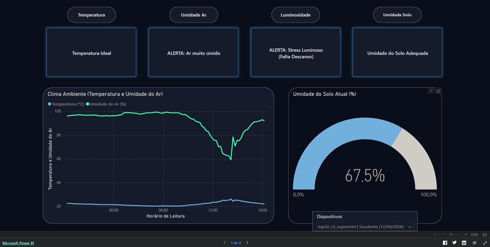

# 🌿 Plant Sensor Analysis (ESP32 + Supabase)

Este projeto de IoT e Engenharia de Dados realiza o monitoramento autônomo do clima e umidade do solo, transmitindo os dados diretamente para um Data Lake na nuvem (Supabase/PostgreSQL) via API REST. O projeto adota a **Arquitetura Medalhão (Bronze, Silver, Gold)** e o paradigma **ELT (Extract, Load, Transform)** para garantir a qualidade, rastreabilidade e segurança dos dados.

## 📊 Dashboard Interativo (Power BI)
*Interaja com o relatório ao vivo abaixo. Utilize as setas no rodapé do painel para navegar entre as visões de Tempo Real, Resumo Tático (7 Dias) e Visão Estratégica Mensal.*

🔗 **[Clique aqui para abrir o Dashboard em tela cheia em uma nova aba](https://app.powerbi.com/view?r=eyJrIjoiOGE3NzM3YWQtZGVhMC00OTc4LTliOTEtMTU5MDE3ZTk1MjgyIiwidCI6IjdlOTNlMjg2LWIyOWEtNDQ1NC1hNDFhLWU4NDE5ZWM5ZGViNSJ9&pageName=fdfbc4c6a69c2e7bc151)**

---

## 🏗️ Arquitetura e Engenharia de Dados (ELT)

1. **Hardware (Edge Computing):** ESP32-C3 SuperMini programado em MicroPython.
2. **Sensores:** DHT22 (Temperatura/Umidade do Ar), Sensor de Umidade do Solo Analógico e Sensor de Luz Digital (BH1750 via I2C).
3. **Eficiência Energética:** Utiliza `machine.deepsleep()` para economizar bateria entre os ciclos de leitura.
4. **Extração e Carregamento (E e L):** Envio direto do hardware para a Camada Bronze do Supabase via HTTP POST, armazenando o payload bruto em uma coluna `JSONB`. Scripts em Python funcionam como via de contingência para APIs externas.
5. **Transformação via dbt (T):** O Data Build Tool atua diretamente dentro do Data Lake operando nas camadas seguintes:
   * **Camada Silver:** View (`vw_leituras_silver`) responsável por descompactar o JSON, converter os tipos, ajustar o fuso horário e aplicar políticas de segurança.
   * **Camada Gold (Roteamento Dinâmico & Agregação):** Dividida em duas *Fato* principais:
     * **Granulada (Tempo Real):** Cruzamento das leituras de momento com os limites biológicos via seed (`cadastro_sensores.csv`). Gera alertas imediatos de temperatura e rega.
     * **Agregada (Resumo Diário):** Modelagem focada no *Daily Light Integral* (DLI), agrupando os dados de luminosidade do sensor BH1750 para calcular o tempo total de exposição solar útil no dia.

## 📁 Estrutura do Projeto
* `/main.py`: O código principal de produção otimizado para a placa.
* `/ingestao_perenual.py`: Script de extração responsável por buscar os metadados das plantas na API.
* `/plant_sensor_dbt/`: Repositório de transformação de dados contendo as models em SQL (Silver/Gold) e o dicionário de dados (Seeds).
* `/poc/`: Provas de conceito e testes isolados de hardware.

## 🛠️ Pré-requisitos de Desenvolvimento (dbt)
Para rodar as transformações locais e gerar a documentação da Camada Gold, é recomendado o uso de um ambiente virtual (`venv`) para evitar conflitos de dependência.
* **Python:** Versão `3.11.x` (64-bits)
* **dbt-core:** `v1.11.7`
* **dbt-postgres:** `v1.10.0`

## 📐 Calibração e Regras de Negócio (Camada Gold)

Os sensores retornam valores brutos. Para gerar métricas amigáveis e *insights* acionáveis, aplicamos as seguintes transformações:

1. **Umidade do Solo (Calibração Empírica):** Os valores brutos de voltagem (0-4095) são convertidos em percentagem (0-100%) através de interpolação linear (Regra de Três) em SQL:
   * `3050` = 0% de Umidade (Sensor seco)
   * `600` = 100% de Umidade (Sensor submerso)
2. **Luminosidade (Sensor BH1750 I2C):** Leitura de altíssima precisão em Lux. Os dados são agregados na tabela `gold_diaria_monitorizacao` para definir a saúde fotossintética do dia.
   * Foi implementada uma separação semântica entre o limiar físico de escuridão (< 50 lux) para medir o fotoperíodo, e o limite biológico de fotossíntese (lux_min) para gerar alertas de saúde da planta.
3. **Enriquecimento Híbrido de Dados (Tabela Fato x Dimensão):** Os limites ideais de rega e luz para cada espécie são cruzados (`JOIN`) com as leituras. Utiliza-se a função `COALESCE` para priorizar a fonte primária (dicionário oficial ESALQ/USP em dbt seed) e usar a API Perenual apenas como *fallback*.
  
## 🧪 Qualidade de Dados e Governança (dbt)
* **Documentação e Linhagem (DAG):** Dicionário de dados mapeado desde a origem (Bronze) até ao produto final (Gold). 
  * 🔗 **[Clique aqui para acessar o Dicionário de Dados Interativo (dbt docs)](https://irpedro.github.io/ICF/)** gerado automaticamente via CI/CD (GitHub Actions).
* **Testes Automatizados:** Validação de integridade (`unique`, `not_null`) aplicada diretamente nas camadas Silver e Gold através do ficheiro `schema.yml`.

## 🚀 Próximos Passos
- [x] **Ingestão (Bronze) & Tratamento (Silver):** Hardware enviando dados e visualização limpa configurada no Supabase.
- [x] **Calibração do Solo:** Limites físicos testados e mapeados.
- [x] **Dicionário Científico:** Arquivo *seed* estático no dbt criado com limites da literatura agronômica.
- [x] **Camada Gold (Negócio):** View final desenvolvida cruzando leituras com limites biológicos.

**Frente 1: Hardware & Engenharia de Dados (Coleta de Luz)**
- [x] **Configuração do BH1750:** Otimizado o `main.py` para utilizar a biblioteca do sensor de luz digital I2C (pinos 5 e 6).
- [x] **Nova Modelagem dbt (DLI):** Desenvolvida a tabela `gold_diaria_monitorizacao` para calcular o acúmulo de horas de luz úteis diárias.

**Frente 2: Visualização & Business Intelligence (Power BI)**
- [x] **Resolução de Infraestrutura:** Conexão direta Power BI Desktop -> Supabase Pooler configurada, ignorando bloqueios de certificado SSL da nuvem.
- [x] **Construção do Dashboard:** Visualizações de tempo real (Página 1) e gráficos de acompanhamento agregado (Página 2, 3 e 4) conectadas ao modelo semântico local.
- [x] **Refinamento de UI/UX:** Dark Mode aplicado, com métricas complexas transformadas em Cartões KPI dinâmicos e Tooltips.
- [x] **Deploy:** Publicação do painel interativo diretamente no GitHub (Web Embed).

**Frente 3: Refinamento e Teste Final**
- [ ] **Reset da Camada Bronze:** Apagar os dados de teste ("lixo" de desenvolvimento).
- [x] **Automação Ativa (Opcional):** Implementar webhooks com n8n para disparo de alertas.
- [ ] **Documentação Visual (Make.com):** Criar diretório `/docs/images` para hospedar os prints arquiteturais dos cenários e realizar o commit final.
- [ ] **Teste Final em Produção:** Testar e monitorar a planta com o projeto completo rodando em Deep Sleep.

## 🤖 Automação e Alertas (Make.com + Telegram)

Para fechar o ciclo de dados (do hardware até a palma da mão), foi implementada uma camada de orquestração rodando 100% na nuvem utilizando o **Make.com**. A arquitetura foi desenhada no padrão *Scheduled Multiplexer* para otimizar o uso da infraestrutura gratuita, avaliando múltiplas regras de negócio em uma única execução.

O fluxo é ativado a cada 6 horas e consome diretamente a Camada Gold do dbt (Supabase), ramificando-se em três rotas analíticas distintas:

* **Rota A (Observabilidade de Hardware):** Verifica a saúde da infraestrutura calculando o `minutos_offline` (Timestamp do Servidor vs. Último envio do ESP32). Dispara alertas críticos se a placa perder conexão Wi-Fi ou bateria.
* **Rota B (Prevenção e Saúde da Planta):** Monitoriza regras de negócio críticas, como "Solo Seco". Possui um sistema integrado de *Cooldown* (usando Make Data Stores) que bloqueia envios repetidos por 12 horas, atuando como um filtro Anti-Spam.
* **Rota C (Fechamento do Dia):** Protegida por um filtro de *Timezone* que só abre a catraca às 20h. Faz um `LEFT JOIN` on-the-fly entre a foto de momento (tabela granulada) e as agregações do dbt (tabela diária), enviando um boletim completo com:
    * Máximas e Mínimas do dia (Temperatura e Umidade).
    * *Daily Light Integral* (Horas de Sol Útil e Diagnóstico de Saúde Luminosa).
    * Uptime real do sistema (% de confiabilidade dos dados nas últimas 24h).

> 💡 **Nota de Reprodutibilidade:** Os cenários do Make.com e o Bot do Telegram possuem chaves de API privadas (Hardcoded Tokens) e não estão diretamente disponíveis no repositório. Para replicar este projeto, será necessário configurar o seu próprio *bot* via BotFather e conectar os webhooks da sua conta Make ao seu banco de dados PostgreSQL. Para conferir a estrutura visual dos cenários, consulte a pasta `/docs/images`.

## 🚀 Visão de Futuro e Escalabilidade

O projeto foi desenhado seguindo princípios de arquitetura modular, permitindo a sua evolução de uma ferramenta de monitorização pessoal para uma plataforma escalável (SaaS). As próximas etapas de desenvolvimento focam-se em:

### 1. Desacoplamento e Multi-tenancy
Atualmente, as notificações estão configuradas para um utilizador administrativo. A evolução prevê a criação de uma camada de gestão de utilizadores no PostgreSQL, onde cada sensor é vinculado a um `id_utilizador`. 
- **Notificações Dinâmicas:** O motor de regras no Make.com passará a consultar o `telegram_chat_id` diretamente da base de dados, permitindo que o sistema suporte múltiplos utilizadores em simultâneo.

### 2. Interface de Utilizador (Portal de Gestão)
Para eliminar a necessidade de configuração via SQL por parte do utilizador, está prevista a criação de um Front-end unificado.
- **Provisionamento Self-service:** Interface para registo de novos sensores e mapeamento de espécies botânicas.
- **Dashboards Dinâmicos:** Integração com Power BI através de filtragem dinâmica de parâmetros, permitindo que o utilizador visualize os dados específicos de cada sensor de forma isolada num único ambiente centralizado.